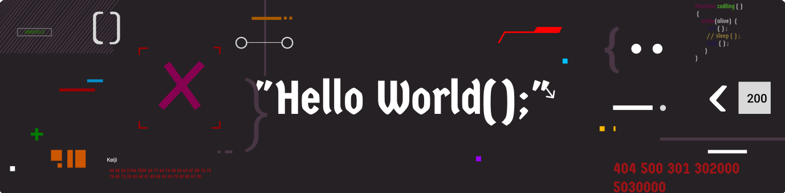

# Bienvenue sur mon profil GitHub !

Bonjour, je suis Manu-Alriche, un développeur web  passionné par la création d'applications web modernes et interactives. Actuellement en formation chez O'Clock, j'apprends les dernières technologies et bonnes pratiques du développement web.

## Mes Compétences

- **Langages :** HTML, CSS, JavaScript
- **Frameworks :** Svelte
- **Outils :** Git, NPM

Je suis toujours à la recherche de nouvelles opportunités pour apprendre et grandir en tant que développeur. N'hésitez pas à explorer mes projets et à me contacter pour toute opportunité ou collaboration !
